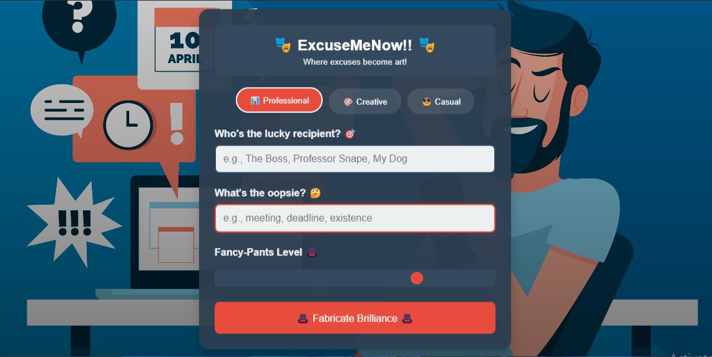
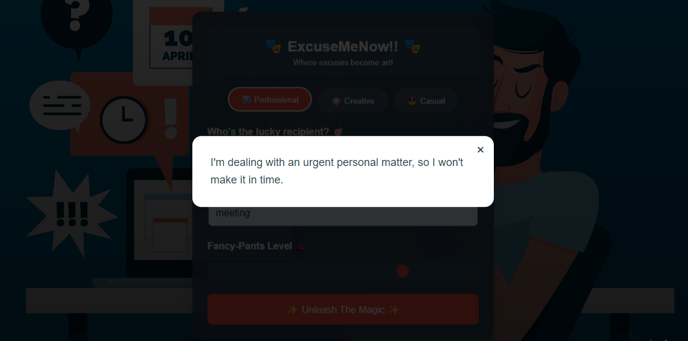
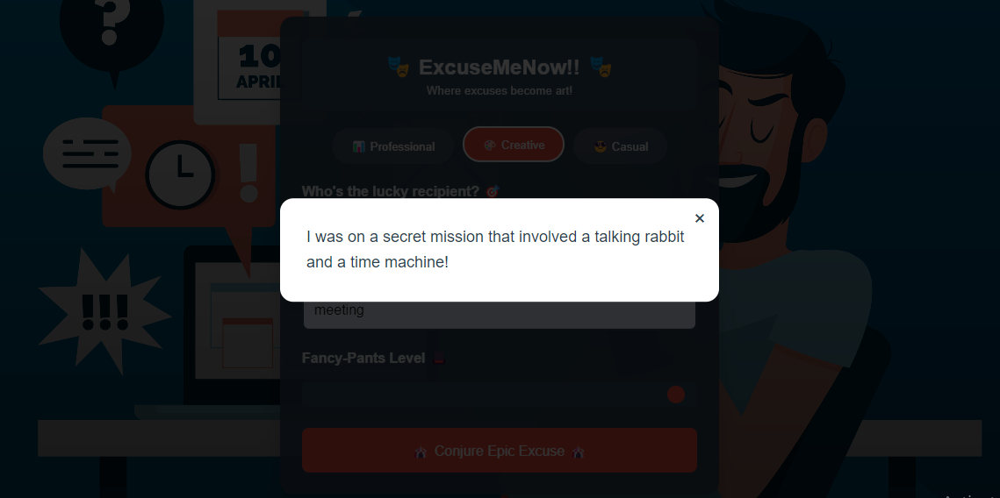
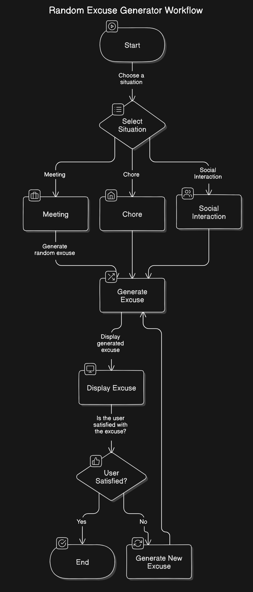

# ExcuseMeNow 🎯

## Basic Details
### Team Name: Code Ctrl

### Team Members
- Team Lead: Abin Varghese - St.Joseph's College of Engineering and Technology Palai
- Member 2: Liya Tony - St.Joseph's College of Engineering and Technology Palai

### Project Description
ExcuseMeNow! is a fun and quirky generator that offers random, outlandish excuses to help you gracefully escape meetings, chores, or uncomfortable situations. It’s the ultimate “Get-Out-Of-It” card for any scenario!

### The Problem (that doesn't exist)
Ever find yourself in a meeting you never wanted to attend? Or perhaps a chore that mysteriously becomes someone else's responsibility? ExcuseMeNow! solves the “problem” of finding the perfect reason to exit gracefully.

### The Solution (that nobody asked for)
Using randomness and a healthy dose of humor, ExcuseMeNow! delivers excuses that are creative, unexpected, and sometimes a bit absurd. Simply press a button, and voilà—a perfect excuse for any occasion!

## Technical Details
### Technologies/Components Used
For Software:
- Html,CSS
- Firebase
- Gemini API
- VS Code

For Hardware:
- Not Applicable for this project

### Implementation
For Software:
# Installation
    
      git clone https://github.com/yourusername/excusemenow.git
      cd excusemenow
      npm install
# Run
     
        npm start
 

### Project Documentation
For Software:

# Screenshots (Add at least 3)
![Screenshot1]

*Home Page*

![Screenshot2]

*Generating Random Excuse*

![Screenshot3]

*Generating Random Excuse*

# Diagrams

Workflow showing the process from selecting a situation to displaying the generated excuse, with options for generating a new excuse if not satisfied

For Hardware:

- Not Applicable for this project

### Project Demo
# Video
[Add your demo video link here]
*Explain what the video demonstrates*

# Additional Demos
[Add any extra demo materials/links]

## Team Contributions
- Abin Varghese: Frontend
- Liya Tony: Backend

---
Made with ❤️ at TinkerHub Useless Projects 

